# 🏗️ Цільова Архітектура NovaPay Compliance Tool

```mermaid
graph TB
    %% External Users
    subgraph "👥 Users"
        U1[Compliance Officers]
        U2[Auditors]
        U3[Risk Managers]
        U4[IT Administrators]
    end

    %% CDN and Load Balancer
    subgraph "🌐 CDN & Load Balancing"
        CDN[CloudFlare CDN]
        LB[Load Balancer<br/>Nginx/HAProxy]
        WAF[Web Application Firewall]
    end

    %% Frontend Layer
    subgraph "🎨 Frontend Layer"
        subgraph "React SPA (Optimized)"
            FE1[Dashboard Page<br/>Lazy Loaded]
            FE2[Audit Flow<br/>Lazy Loaded]
            FE3[Risk Repository<br/>Lazy Loaded]
            FE4[Admin Panel<br/>Lazy Loaded]
            FE5[Reports<br/>Lazy Loaded]
        end
        
        subgraph "Frontend Optimization"
            BUNDLE[Code Splitting<br/>Bundle: 10MB]
            CACHE[Browser Cache<br/>Service Workers]
        end
    end

    %% API Gateway
    subgraph "🚪 API Gateway"
        GATEWAY[Kong/Ambassador<br/>Rate Limiting<br/>Authentication<br/>Request Routing]
    end

    %% Backend Services
    subgraph "⚙️ Backend Services (Microservices)"
        subgraph "Core Services"
            AUTH[Auth Service<br/>JWT + MFA<br/>OAuth2]
            USER[User Service<br/>RBAC]
            COMPANY[Company Service<br/>Multi-tenant]
        end
        
        subgraph "Compliance Services"
            AUDIT[Audit Flow Service<br/>Async Processing]
            RISK[Risk Service<br/>Real-time Analytics]
            EVIDENCE[Evidence Service<br/>File Storage]
            FRAMEWORK[Framework Service<br/>Cached]
        end
        
        subgraph "AI Services"
            AI_ASYNC[Async AI Service<br/>Task Queue<br/>3 Workers]
            AI_CACHE[AI Content Cache<br/>Redis]
        end
        
        subgraph "Reporting Services"
            REPORT[Report Service<br/>PDF Generation]
            ANALYTICS[Analytics Service<br/>Real-time Dashboards]
        end
    end

    %% Caching Layer
    subgraph "💾 Caching Layer"
        REDIS[Redis Cluster<br/>Session Store<br/>API Cache<br/>AI Task Queue]
        MEMCACHE[Memcached<br/>Query Cache]
    end

    %% Message Queue
    subgraph "📨 Message Queue"
        RABBITMQ[RabbitMQ/RabbitMQ<br/>Event Streaming<br/>Task Distribution]
    end

    %% Database Layer
    subgraph "🗄️ Database Layer"
        subgraph "Primary Database"
            PG_MASTER[PostgreSQL Master<br/>Optimized Indexes<br/>Connection Pooling]
            PG_REPLICA1[PostgreSQL Replica 1<br/>Read Operations]
            PG_REPLICA2[PostgreSQL Replica 2<br/>Read Operations]
        end
        
        subgraph "Vector Database"
            QDRANT[Qdrant Cluster<br/>Document Embeddings<br/>Semantic Search]
        end
        
        subgraph "File Storage"
            S3[Object Storage<br/>S3/MinIO<br/>Evidence Files<br/>Reports]
        end
    end

    %% External Services
    subgraph "🔌 External Services"
        OPENAI[OpenAI API<br/>GPT-4<br/>Async Processing]
        EMAIL[Email Service<br/>SMTP/SendGrid]
        SMS[SMS Service<br/>Twilio]
        NOTIFICATIONS[Push Notifications<br/>Firebase]
    end

    %% Monitoring & Observability
    subgraph "📊 Monitoring & Observability"
        PROMETHEUS[Prometheus<br/>Metrics Collection]
        GRAFANA[Grafana<br/>Dashboards]
        JAEGER[Jaeger<br/>Distributed Tracing]
        ELASTIC[ELK Stack<br/>Log Aggregation]
        SENTRY[Sentry<br/>Error Tracking]
    end

    %% Security Layer
    subgraph "🔒 Security Layer"
        VAULT[HashiCorp Vault<br/>Secrets Management]
        SCANNER[Security Scanner<br/>SAST/DAST]
        BACKUP[Backup Service<br/>Encrypted Backups]
    end

    %% Infrastructure
    subgraph "☁️ Infrastructure (Kubernetes)"
        subgraph "Production Cluster"
            K8S_MASTER[K8s Master<br/>Control Plane]
            K8S_NODES[Worker Nodes<br/>Auto-scaling]
        end
        
        subgraph "Staging Cluster"
            K8S_STAGING[Staging Environment<br/>Testing]
        end
        
        subgraph "CI/CD Pipeline"
            GITLAB[GitLab CI/CD<br/>Automated Testing<br/>Deployment]
            REGISTRY[Container Registry<br/>Docker Images]
        end
    end

    %% Data Flow Connections
    U1 --> CDN
    U2 --> CDN
    U3 --> CDN
    U4 --> CDN
    
    CDN --> LB
    LB --> WAF
    WAF --> GATEWAY
    
    GATEWAY --> AUTH
    GATEWAY --> USER
    GATEWAY --> COMPANY
    GATEWAY --> AUDIT
    GATEWAY --> RISK
    GATEWAY --> EVIDENCE
    GATEWAY --> FRAMEWORK
    GATEWAY --> AI_ASYNC
    GATEWAY --> REPORT
    GATEWAY --> ANALYTICS
    
    %% Service Dependencies
    AUTH --> REDIS
    USER --> PG_MASTER
    COMPANY --> PG_MASTER
    AUDIT --> PG_REPLICA1
    RISK --> PG_REPLICA2
    EVIDENCE --> S3
    FRAMEWORK --> REDIS
    AI_ASYNC --> RABBITMQ
    AI_ASYNC --> OPENAI
    REPORT --> S3
    ANALYTICS --> PG_REPLICA1
    
    %% Database Connections
    PG_MASTER --> PG_REPLICA1
    PG_MASTER --> PG_REPLICA2
    
    %% Cache Connections
    AUTH --> REDIS
    FRAMEWORK --> REDIS
    AI_ASYNC --> REDIS
    AUDIT --> MEMCACHE
    
    %% Vector Database
    EVIDENCE --> QDRANT
    AI_ASYNC --> QDRANT
    
    %% External Services
    AI_ASYNC --> OPENAI
    USER --> EMAIL
    AUDIT --> SMS
    RISK --> NOTIFICATIONS
    
    %% Monitoring
    AUTH --> PROMETHEUS
    USER --> PROMETHEUS
    COMPANY --> PROMETHEUS
    AUDIT --> PROMETHEUS
    RISK --> PROMETHEUS
    AI_ASYNC --> PROMETHEUS
    
    PROMETHEUS --> GRAFANA
    AUTH --> JAEGER
    USER --> JAEGER
    AUDIT --> JAEGER
    
    %% Security
    AUTH --> VAULT
    USER --> VAULT
    COMPANY --> VAULT
    AI_ASYNC --> VAULT
    
    %% Infrastructure
    AUTH --> K8S_NODES
    USER --> K8S_NODES
    COMPANY --> K8S_NODES
    AUDIT --> K8S_NODES
    RISK --> K8S_NODES
    AI_ASYNC --> K8S_NODES
    
    K8S_MASTER --> K8S_NODES
    GITLAB --> REGISTRY
    REGISTRY --> K8S_NODES

    %% Styling
    classDef userClass fill:#e1f5fe,stroke:#01579b,stroke-width:2px
    classDef frontendClass fill:#f3e5f5,stroke:#4a148c,stroke-width:2px
    classDef backendClass fill:#e8f5e8,stroke:#1b5e20,stroke-width:2px
    classDef databaseClass fill:#fff3e0,stroke:#e65100,stroke-width:2px
    classDef cacheClass fill:#fce4ec,stroke:#880e4f,stroke-width:2px
    classDef externalClass fill:#f1f8e9,stroke:#33691e,stroke-width:2px
    classDef monitoringClass fill:#e0f2f1,stroke:#004d40,stroke-width:2px
    classDef securityClass fill:#ffebee,stroke:#b71c1c,stroke-width:2px
    classDef infraClass fill:#e3f2fd,stroke:#0d47a1,stroke-width:2px

    class U1,U2,U3,U4 userClass
    class FE1,FE2,FE3,FE4,FE5,BUNDLE,CACHE frontendClass
    class AUTH,USER,COMPANY,AUDIT,RISK,EVIDENCE,FRAMEWORK,AI_ASYNC,AI_CACHE,REPORT,ANALYTICS backendClass
    class PG_MASTER,PG_REPLICA1,PG_REPLICA2,QDRANT,S3 databaseClass
    class REDIS,MEMCACHE,RABBITMQ cacheClass
    class OPENAI,EMAIL,SMS,NOTIFICATIONS externalClass
    class PROMETHEUS,GRAFANA,JAEGER,ELASTIC,SENTRY monitoringClass
    class VAULT,SCANNER,BACKUP securityClass
    class K8S_MASTER,K8S_NODES,K8S_STAGING,GITLAB,REGISTRY infraClass
```

## 🎯 **Ключові Компоненти Цільової Архітектури**

### **1. Frontend Layer (Оптимізований)**
- **React SPA** з lazy loading
- **Code Splitting** - bundle розмір 10MB
- **Service Workers** для кешування
- **CDN** для статичних ресурсів

### **2. API Gateway**
- **Kong/Ambassador** для маршрутизації
- **Rate Limiting** (100/min GET, 10/min POST, 5/min AI)
- **JWT Authentication** + MFA
- **Request/Response Compression**

### **3. Microservices Architecture**
- **Auth Service** - JWT + OAuth2 + MFA
- **User Service** - RBAC з кешуванням
- **Company Service** - Multi-tenant
- **Audit Flow Service** - Асинхронна обробка
- **Risk Service** - Real-time analytics
- **AI Service** - Task queue з 3 воркерами

### **4. Caching Strategy**
- **Redis Cluster** - Session store, API cache, AI queue
- **Memcached** - Query cache
- **Browser Cache** - Service workers
- **CDN Cache** - Статичні ресурси

### **5. Database Architecture**
- **PostgreSQL Master** - Write operations
- **PostgreSQL Replicas** - Read operations
- **Qdrant Cluster** - Vector embeddings
- **Object Storage** - Files та reports

### **6. Message Queue**
- **RabbitMQ** - Event streaming
- **Task Distribution** - AI processing
- **Event Sourcing** - Audit trails

### **7. Monitoring & Observability**
- **Prometheus** - Metrics collection
- **Grafana** - Dashboards
- **Jaeger** - Distributed tracing
- **ELK Stack** - Log aggregation
- **Sentry** - Error tracking

### **8. Security Layer**
- **HashiCorp Vault** - Secrets management
- **Security Scanner** - SAST/DAST
- **Encrypted Backups** - Automated
- **WAF** - Web Application Firewall

### **9. Infrastructure (Kubernetes)**
- **Production Cluster** - Auto-scaling
- **Staging Environment** - Testing
- **CI/CD Pipeline** - GitLab
- **Container Registry** - Docker images

---

## 📊 **Продуктивність Цільової Архітектури**

### **Масштабованість**
- **Horizontal Scaling** - Kubernetes auto-scaling
- **Database Sharding** - По companies
- **Cache Distribution** - Redis cluster
- **Load Balancing** - Multi-region

### **Надійність**
- **99.9% Uptime** - Multi-region deployment
- **Auto-failover** - Database replicas
- **Circuit Breakers** - Service resilience
- **Health Checks** - Automated monitoring

### **Безпека**
- **Zero Trust** - Micro-segmentation
- **Encryption** - At rest та in transit
- **Audit Logging** - Comprehensive
- **Compliance** - GDPR, ISO 27001

### **Продуктивність**
- **API Response** - <200ms (95th percentile)
- **Database Queries** - <50ms
- **Cache Hit Rate** - >90%
- **AI Processing** - Async, non-blocking

---

## 🚀 **Етапи Впровадження**

### **Фаза 1: Критичні Виправлення** ✅
- Hardcoded credentials
- Database indexes
- Connection pooling
- Rate limiting
- CORS security
- Input validation
- JWT optimization

### **Фаза 2: Оптимізація Продуктивності** ✅
- N+1 query fix
- Redis caching
- Async AI processing
- Frontend bundle optimization
- Pagination
- Compression

### **Фаза 3: Масштабування та Моніторинг** (Наступна)
- Kubernetes deployment
- Microservices migration
- Advanced monitoring
- Multi-region setup
- Auto-scaling
- CI/CD pipeline

---

**Цільова архітектура забезпечує високу продуктивність, масштабованість та надійність для enterprise рівня! 🚀**
